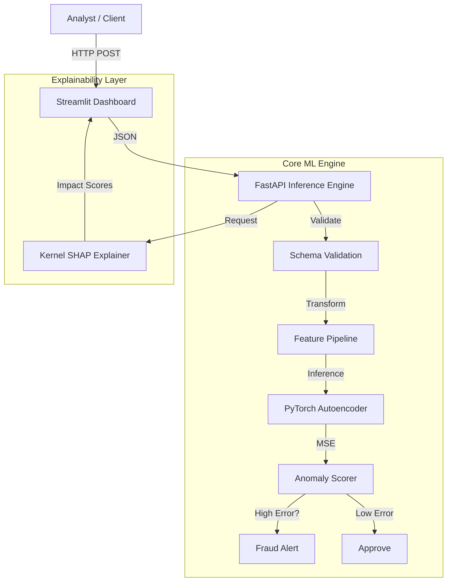

# 🛡️ Sentinelle: Deep Learning Fraud Detection Engine

**A production-ready anomaly detection system designed for high-throughput FinTech environments.**

Sentinelle is an end-to-end machine learning pipeline that detects financial fraud using **Unsupervised Deep Learning (Autoencoders)**. Unlike traditional classifiers that require massive labeled datasets, Sentinelle learns the latent representation of "normal" transaction patterns and flags anomalies based on reconstruction error (MSE).

It features a full **MLOps stack**: reproducible training pipelines, a type-safe **FastAPI** inference engine, **SHAP** explainability, and a **Streamlit** dashboard for real-time analyst review.

---

## 🚀 Key Features

* **🧠 Deep Anomaly Detection:** PyTorch Autoencoder trained on synthetic banking data to handle extreme class imbalance (<0.5% fraud).
* **🔍 Explainable AI (XAI):** Integrated **Kernel SHAP** to explain *why* a transaction was rejected (e.g., *"Amount > 99th percentile"*).
* **⚡ Real-Time Inference:** High-performance **FastAPI** serving layer with Pydantic validation and sub-20ms latency.
* **📊 Analyst Dashboard:** Interactive **Streamlit** UI for visualizing anomaly scores and feature contributions in real-time.
* **⚙️ MLOps & CI/CD:** Fully containerized with **Docker** and automated testing via **GitHub Actions** (Unit Tests → Artifact Generation → Docker Build).

---

## 🏗️ Architecture

The system follows a microservice architecture, separating the Model Training, Inference API, and Frontend Dashboard.

## 📸 Dashboard Preview
[!Dashboard](Screenshot.png)
The dashboard allows analysts to:

* **Simulate Transactions**: Adjust Amount, Category, and Time.
* **View Risk Score**: See the reconstruction error (MSE) relative to the dynamic threshold.
* **Understand "Why"**: The bar chart uses SHAP values to show which features pushed the transaction into "Fraud" territory.

## 🧪 Testing & CI/CD
This project uses GitHub Actions for Continuous Integration. Every push to main triggers:

* **Unit Tests**: Runs pytest to verify model architecture and pipeline logic.
* **Integration Check**: Generates dummy data and performs a full training run.
* **Container Build**: Builds the Docker image to ensure deployment readiness.